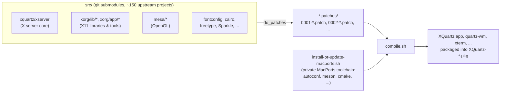

# XQuartz

[](https://github.com/XQuartz/XQuartz/actions/workflows/build.yml)

XQuartz is the community-supported port of the [X.Org X Window System](https://x.org) to macOS. It provides the `X11.app` that Apple bundled with OS X 10.5 through 10.7, and continues to ship it as a separate download for later macOS releases. It includes the X server itself along with supporting libraries and applications, and a lightweight window manager (`quartz-wm`) that integrates X11 windows with the macOS desktop.

Downloads, release notes, and support resources: **[xquartz.org](https://www.xquartz.org/)**. General questions and support requests belong on the [mailing lists](https://www.xquartz.org/Support.html); if you've found an actual bug, file it on [GitHub Issues](https://github.com/XQuartz/XQuartz/issues) — see [Bug Reporting](https://www.xquartz.org/Bug-Reporting.html) for that distinction and for where component-specific issues belong instead.

## Architecture

XQuartz is assembled from roughly 150 upstream projects — the X server, Mesa, Cairo, fontconfig, FreeType, every `xorg/app`, `xorg/lib`, and font package, and more — each vendored as its own git submodule under `src/`, plus a private MacPorts-based toolchain (`install-or-update-macports.sh`) that provides build tools (autoconf, meson, cmake, ...) without assuming they're already on a contributor's machine. `compile.sh` drives all of it: for each submodule, it applies any patches queued in that submodule's `<name>.patches/` directory (plain `patch -p1` files, numbered `0001-`, `0002-`, ...) before building, then assembles the results into `XQuartz.app` and its bundled tools, and packages an installable `.pkg`.



At runtime, `XQuartz.app` splits into two threads that only talk to each other through the X server's own event queue, not shared memory: an AppKit thread (`hw/xquartz/X11Controller.m`, `X11Application.m`) running the Cocoa application, and the X server thread (`dix_main`, including the Darwin-specific event handling in `hw/xquartz/darwinEvents.c`) running the actual X11 server. Custom events cross between them via `DarwinSendDDXEvent()`, which enqueues onto the X server's `mieq` queue. See [docs/bugs-history/DISPLAYS_ISSUE.md](docs/bugs-history/DISPLAYS_ISSUE.md) for a worked example of this runtime split (and its pitfalls) in the context of an actual bug.

## Building

XQuartz only builds on macOS, with Xcode's command line tools installed. From a clean checkout:

```sh
git submodule update --init --recursive
sudo ./install-or-update-macports.sh   # bootstraps a private MacPorts toolchain, one-time
./compile.sh                            # builds XQuartz and produces XQuartz-*.pkg
```

See [build.yml](.github/workflows/build.yml) for the exact sequence used in CI, including how code signing is disabled for unsigned CI builds, and [Developer Info](https://www.xquartz.org/Developer-Info.html) for the fuller manual build/environment writeup.

## Contributing

See [CONTRIBUTING.md](CONTRIBUTING.md).

## License

XQuartz is an aggregation of many independent components, each under its own OSI-approved license (MIT, BSD, APSL-2, GPL-2, LGPL-2, and others). See [LICENSE](LICENSE) for details and where to find the license of a specific component.
