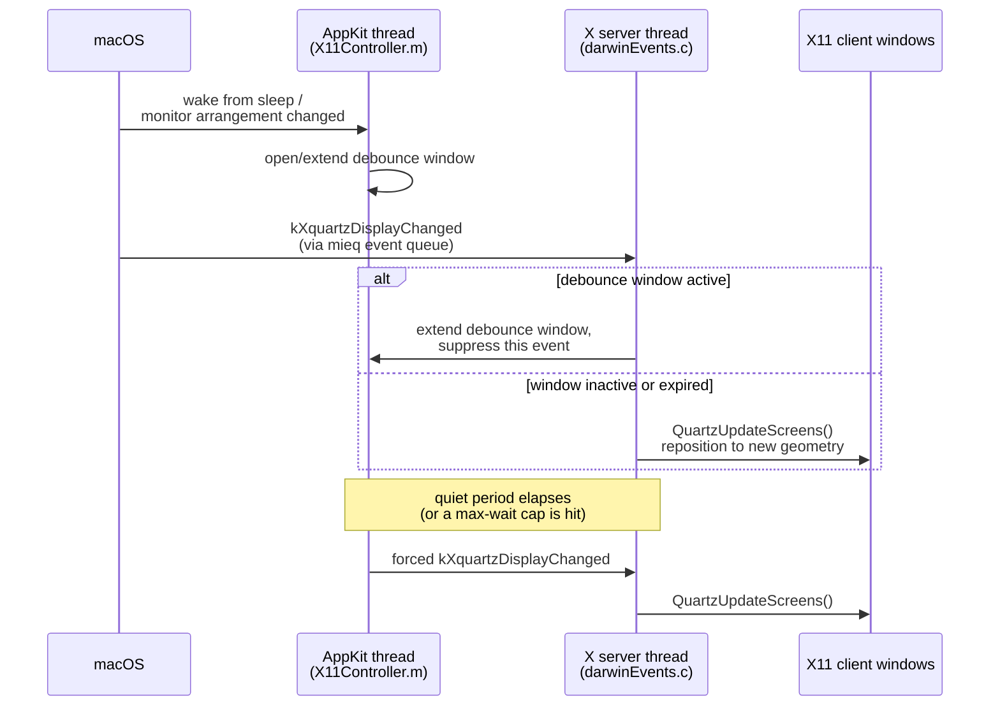

# Multi-monitor window placement (#92)

Tracking issue: [XQuartz/XQuartz#92](https://github.com/XQuartz/XQuartz/issues/92).

On multi-monitor setups, X11 client windows are frequently thrown offscreen or rearranged when XQuartz recomputes display geometry. This has been reported for years, with three distinct triggers:

1. **Wake from sleep.** macOS re-detects displays as they reconnect, and XQuartz reacts to each intermediate state.
2. **Monitor arrangement changes** (adding/removing a display, moving one in System Settings, resolution changes).
3. **"Displays have separate Spaces" enabled** — a different problem: window-to-Space assignment, not display geometry, and not addressed by anything on this page.

Known workarounds (disabling "Displays have separate Spaces", keeping the menu-bar display at the top-left) are inconvenient or give up real functionality. An external tool, [x11arrange](https://github.com/XPOL555/x11arrange), can snapshot and restore window geometry from outside XQuartz — useful, but reactive by nature: it can only re-apply a saved layout after XQuartz has already moved things.

## Why it happens

See the [README's architecture section](../../README.md#architecture) for the general two-thread model. The relevant detail here: `kXquartzDisplayChanged` events reach the X server thread through the same `mieq` queue as everything else, and — prior to any fix — every single one triggers an immediate `QuartzUpdateScreens()`. macOS fires several of these in a burst while it settles on a final display layout after a wake or a monitor change, so windows get repositioned repeatedly against intermediate, not-yet-final geometry.

## The fix attempted here

`src/xquartz/xserver.patches/0002-Debounce-display-reconfiguration-on-wake-and-monito.patch` adds a debounce window, shared via a mutex between the AppKit thread and the X server thread:

- AppKit opens (or extends) the window when it observes `NSWorkspaceDidWakeNotification` or `NSApplicationDidChangeScreenParametersNotification` — covering triggers 1 and 2 above.
- The X server thread extends the window further on every `kXquartzDisplayChanged` it suppresses while the window is open, so a burst of events pushes the deadline out instead of firing on a fixed timer from the first one.
- A capped max-wait bounds the total suppression time, so a pathological, never-settling reconfiguration (e.g. a flapping display connection) can't block updates forever.
- Once the window closes — either a quiet period elapses or the max wait is hit — a single `kXquartzDisplayChanged` is force-posted, and windows are repositioned exactly once against the final geometry.

Trigger 3 ("Displays have separate Spaces") is out of scope for this patch — it's a different subsystem (window-to-Space assignment), not display-reconfiguration event handling.

## Status

Not yet verified on real multi-monitor hardware — only that the patch applies cleanly and the surrounding CI build succeeds. By the project's own standard for patches headed upstream (see [CONTRIBUTING.md](../../CONTRIBUTING.md)), this isn't ready to be submitted as-is. If you can reproduce the bug and are willing to test a build from this patch, that's the most useful thing anyone can currently do here — report back on the tracking issue.
